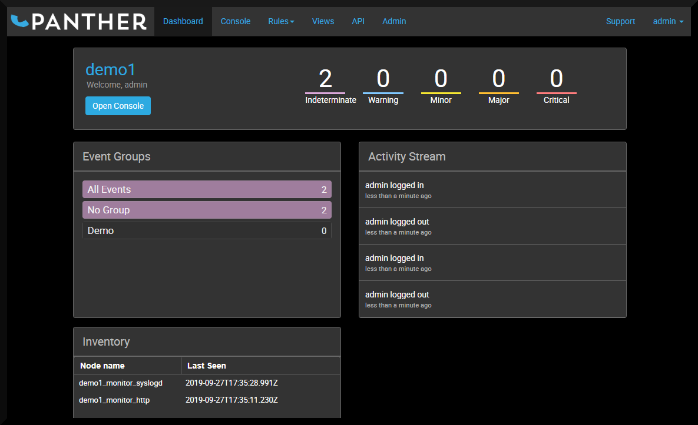

## Introduction
The (beta) cloud-based version of Panther will be accessible at https://panther.support. After a simple Sign-up process your dedicated secure Panther instance will be automatically provisioned within the Panther Cloud. When signing-up you will be asked to choose a unique name for your Console which will then be accessible at https://{your-console-name}.panther.support.

### Using Panther for the First Time

Login for the first time as the user `admin` using the password that was used during Sign-up - this is the default user account that will be used to [administer](/admin/) Panther for the first time.

The first screen that you will see is the [Dashboard](/dashboard/#overview), which will look like this:

Clicking on `Open Console` will take you to the [Console](/console/#overview), which will look like this:

... this example shows that the Panther instance currently has two events in it. These particular messages are coming from the instance's _internal_ `syslogd` and `http` agents which will send periodic "keep-alive" events to indicate that they are healthy. Here, `Agent http is alive` and `Agent syslogd` are the details of the event, contained within the `summary` field (see next section). Double-click on an event to explore it a bit more.

### Anatomy of an Event
A Panther Event is comprised of a number of data fields that are analagous to [The Syslog Protocol](https://tools.ietf.org/html/rfc5424).

| Field | Meaning | Example value |
| ---------- | ------- | ----- | 
| _id | | `5d8a4143f9f0b20100f778f9` |
| acknowledged	| Indicates whether the event has been acknowledged | `false` |
| agent	| The agent that received the event | `syslogd` |
| external_id | A reference to an external identifier (e.g. incident reference) | `OA:12345`  |
| first_occurrence | Date/time when the first event was received | `2019-09-24T16:16:03.825Z` |
| last_occurrence | Date/time when the last event was received | `2019-10-04T12:22:49.063Z` | 
| group	| Grouping applied to this event (determined by Group Rules) |  `Windows Servers` |
| identifier | Unique identifier for this event | `10740737389554512696` | 
| node | Hostname of the device/server that originated the event | `MYWINSERVER123` |
| owner	| The panther user that has taken ownership of this event | `dave` |
| severity | Event Severity (0-5) | `5` _(Warning)_ | 
| state_change | Date/time when the last change to the event occurred | `2019-10-04T12:22:49.066Z` | 
| summary | Event details | `ERROR_OUTOFMEMORY: Not enough storage` `is available to complete this operation` |
| tag | Name of program or process that generated the event | `Microsoft-Windows-Kernel-General` |
| tally	| Could of event occurrences | `1416` |

By default, a unique Event is defined by the combination of the fields: `{node}:{severity}:{summary}:{tag}`.

Multiple events that have the same values for these fields will be treated as the same event, with a counter (`tally`) incremented for each occurrence. Simple [Rules](/rules/#overview) can be used to adjust the contents of these fields (for example, to remove unique data from the `summary` field) which allows Events to be __de-duplicated__ and __enriched__, making them easy to manage.

Double-click on an event and select `Fields` to see its full contents:

See also:
 * [Syslog Mappings](rules/#syslog-mappings)

## Setup Event Sources
There are two main methods to import event logs. Within Panther these are implement by the Syslog and HTTP Agents.

### Syslog
Panther offers the option to receive event logs directly using the Syslog protocol. 

For convenience this can be achieved by downloading a pre-configured rsyslog tarball on the admin page. A tutorial on how to set this up is located in the [admin section](/admin/README#rsyslog-configuration).

### HTTP API
Panther offers the option to submit event logs to it through an API, secured with a key. A tutorial on how to use the API and generate a key is in the [admin section](/admin/README#api-keys).

### Graylog (future)

### SNMP Trap (future)

## Event Source Examples
Below is a list of just some of the freely available software packages that can generate events that Panther can manage.

| Software | How |
| ---------- | ------- |  
| Ryslog  | TODO  |
| Syslog-ng | TODO  |
| NXLog | TODO  |
| Log4j | TODO  |
| Log4Net | TODO  |

Examples of approaches that can be used to monitor infrastructure and applications.

| Technology | How |
| ---------- | ------- |  
| Linux | TODO  |
| Windows | TODO  |
| Cisco | TODO  |
| MuleSoft Anypoint Platform | TODO  |
| Dell Boomi | TODO  |

## Configure a Global Rule

Global rules are rules that will be applied to every event log that is received by Panther. By default, you will have some syslog rules and a simple example. There is a tutorial for adding further global rules in the [Rules](/rules/README#global-rules) section.

## Configure a Group rule

There is a tutorial on setting up group rules in the [Rules](/rules/README#group-rules) section, along with a working example in the [API](/api/README#example) section.
