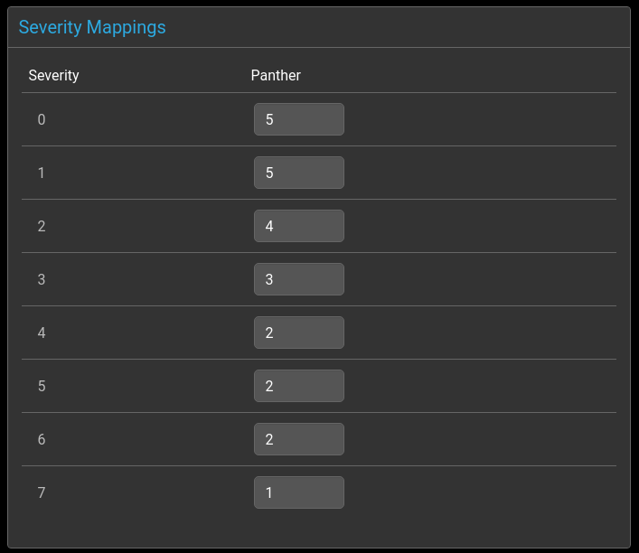

# Overview

There are two Panther event receivers:
 - Syslog
 - HTTP

Events flow through each agent before being processed by the [global](../rules/global.md) and [group](../rules/group.md) rules.

@startuml

"Default Event Identifier" -right-> "Field Mapping"
-right-> "Agent Specific"
-right-> "Field transformations"

@enduml

# Agent Rules

These are common to all agents

## Default Event Identifier

  

The event's `identifier` field uniquely identifies an event in the console.

By default this is created by combining the node, severity, tag and summary fields: 

  `{node}:{severity}:{tag}:{summary}`

Any events with a matching identifier will be grouped together, and
the corresponding event `tally` will increase by 1.

If no matching event identifier is found, then a new event is created.

Timestamps are also stored for each event.

>_Please note that when events are deduplicated via the `identifier` field, some information may be lost. For example, the PID of a process can change regularly, but is not included in the identifier by default, so multiple PIDs may aggregate into a single event._

## Field Mapping


## Field Transformers


The transforms allow pre-defined functions to be applied to event
console fields before rules processing takes place.

Currently supported transformations are

| Transformation | Description                   |
| -------------- | ----------------------------- |
| Lower Case     | lowercases a field value      |
| Upper Case     | uppercases a field value      |
| Left Trim      | Trims whitespace on the left  |
| Right Trim     | Trims whitespace on the right |

# Agent Specific - Syslog

Syslog message fields need to be mapped to event console fields. These fields
will then be available for matching in rules processing.

Currently supported fields are as follows:

## Common to all Syslog messages

| Field        | Example                  |
| ------------ | ------------------------ |
| `prival`     | `<PRIVAL>`               |
| `facilityID` |                          |
| `severityID` |                          |
| `facility`   | local2                   |
| `severity`   | warn                     |
| `type`       | `RFC5424`, `RFC3164`     |
| `time`       | 2022-07-04T16:24:41.786Z |
| `host`       | localhost                |
| `appName`    | sshd                     |
| `message`    | User authentication      |
| `msgid`      | `<MSGID>`                |
| `pid`        | `<PROCID>`               |

## Additional fields for RFC5424

*Note* `structuredData.timeQuality.*` fields are optional, but commonly used. Please refer to you Syslog generators documentation.

| Field                                     | Example         |
| ----------------------------------------- | --------------- |
| `structuredData.timeQuality.tzKnown`      | 1               |
| `structuredData.timeQuality.isSynced`     | 1               |
| `structuredData.timeQuality.syncAccuracy` | 531000          |
| `structuredData.<SD-ID>.<PARAM-NAME>`     | `<PARAM-VALUE>` |


**Example of sending an RFC5424 message**

*Note* Older implementations of `logger` may lack the `--rfc5424` flag, such as CentOS 7.

```bash
logger -p local2.warn -n localhost -T -P 1514 --rfc5424 -t sshd --msgid 1234 --id=44 --sd-id test@123 --sd-param foo=\"bar\" --sd-id more@456 --sd-param fiz=\"baz\" hello world
```

Would make the following fields and values accessible with the Syslog rules:

| Field                                     | Value                    |
| ----------------------------------------- | ------------------------ |
| `prival`                                  | 148                      |
| `facilityID`                              | 18                       |
| `severityID`                              | 4                        |
| `facility`                                | local2                   |
| `severity`                                | warn                     |
| `type`                                    | `RFC5424`                |
| `time`                                    | 2022-07-04T16:24:41.786Z |
| `host`                                    | localhost                |
| `appName`                                 | sshd                     |
| `message`                                 | hello world              |
| `msgid`                                   | 1234                     |
| `pid`                                     | 44                       |
| `structuredData.timeQuality.tzKnown`      | 1                        |
| `structuredData.timeQuality.isSynced`     | 1                        |
| `structuredData.timeQuality.syncAccuracy` | 531000                   |
| `structuredData.test@123.foo`             | bar                      |
| `structuredData.more@456.fiz`             | baz                      |

## Differentiating between RFC3164 and RFC5424 messages

In order to selectively handle the two message formats, you can use an additional selector, such as:

```yaml
      - name: This is a Syslog RFC3164 message
        eq:
          input.type: RFC3164
        set:
          summary: 'This message was formatted as RFC3164'
          agent: 'Syslog {input.type}'

      - name: This is a Syslog RFC5424 message
        eq:
          input.type: RFC5424
        set:
          summary: 'This message was formatted as RFC5424'
          agent: 'Syslog {input.type}'
          external_id: '{input.msgID}'
```

For RFC5424 formatted messages it may also be useful to select based on the availability of `structuredData` elements, with the following:

```yaml
      - name: This is a Syslog RFC5424 message with structuredData
        eq:
          input.type: RFC5424
        field_exists:
          - structuredData.test@123.foo
        set:
          summary: 'This message was formatted as RFC5424 and has structuredData test@123 is {structuredData.test@123.foo}'
          agent: 'Syslog {input.type}'
```


## Severity Mapping



Syslog logging levels need to be mapped to event console severities as
there is not a one to one relationship between them, and the scale is
also inverted.

Syslog levels are defined from 7 (debug) to 0 (emergency).

Panther severities are from 5 (critical) to 0 (clear).


By default, events with severity 0 will be periodically removed from the list of
event logs in the console.


# Agent Specific - HTTP

Sending events via the HTTP API requires sending a JSON payload that minimally conforms to the following structure

*Note* `severity` is an integer from `0` to `5`

```json
{
  "event: {
    "node": "hostname",
    "tag": "some string",
    "summary": "what the event pertains too",
    "severity": 3
  }
}
```

In addition to the above, extra fields can be included within the `event: {}` object.  

*Note* They must be of `String` types.

Given the following JSON payload:

```json
{ 
  "event" {
    "node": "hostname", "tag": "some string", "summary": "what the event pertains too", "severity": 3,
    "extra1": "An additional extra field",
    "extra2": "Agent Smith",
  }
}
```

These additional fields can be referenced within the agent `http.rules.yml`, such as: 

```yaml
agent:
  rules:
    - name: appends extra1 to the summary
      field_exists:
        - "extra1"
      set:
        summary: '{summary} + {extra1}'
        agent: '{extra2}'

```