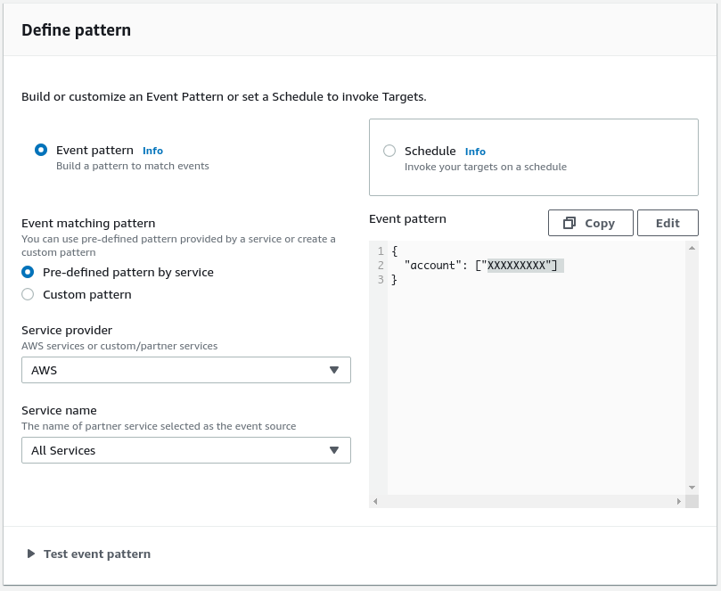
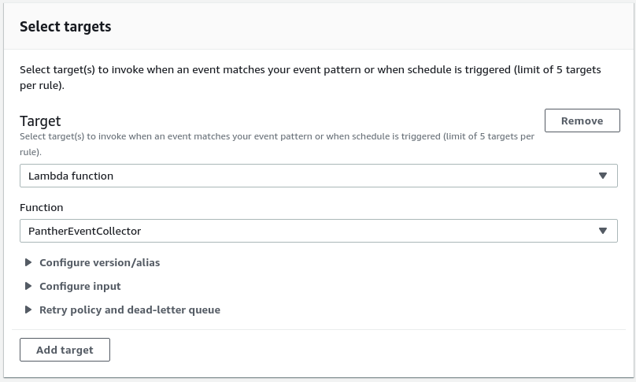
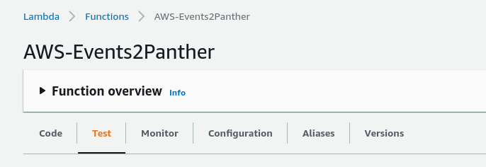
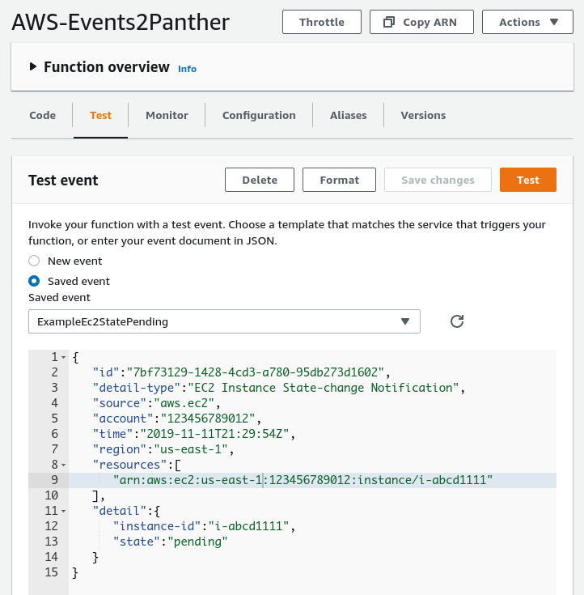

# AWS-Events2Panther

This guide will quickly and easily allow a user to deploy a lambda function to collect AWS events and send them to Panther via it's HTTP API.

AWS events are either region specific or global, depending on the service. So to get all events to your panther console you will have to deploy this lambda function to each of your accounts and regions that you wish to monitor.

The NodeJS Javascript code can be changed by you if you wish to support different AWS events, and/or send different data as part of the message.

Events can be sent to either an [app.panther.support](https://app.panther.support){:target="_blank"} instance or your own self hosted [Dockerised containers](https://hub.docker.com/repository/docker/openanswers/panther-console){:target="_blank"}.


## System Design

This system has ben designed to gather AWS events, extract data from them and send it to your Panther console.

The general flow of events from AWS to Panther can be sumarised by the following:

@startuml
skinparam backgroundColor #eeeeee

!include <awslib/AWSCommon>
!include <awslib/GroupIcons/all.puml>
!include <awslib/Compute/all.puml>
!include <awslib/ManagementAndGovernance/all.puml>
!include <awslib/SecurityIdentityAndCompliance/all.puml>
!define PantherLogo 

Cloudalt(Cloudalt, "", "AWS") #orange {

  Rectangle "sources" #white {
    GuardDuty(GuardDuty1, "","All events from GuardDuty")
    CloudWatch(CloudWatch1, "","All visible events in region")
  }
  LambdaLambdaFunction(LambdaPantherEvent, "panther-aws-events", "")

  sources -down-> LambdaPantherEvent 
  
}

cloud internet

Rectangle Panther #black [
  PantherLogo as A1
]

LambdaPantherEvent -down-> internet : POST to Panther API (app.panther.support)
internet -down-> Panther 

@enduml


1. The Lambda function is triggered whenever a filter matches an event.
2. It will then format the event data into a Panther json message.
3. Then it will send the message to your Panther console using your private API key.


## Running 

Once the code has been successfully registered in AWS you should start seeing a stream of events into Panther.  
Manual testing can be done following the [**AWS Events testing**](./testing.md) instructions.

Further event filtering check [Configuring the captured events](./in-detail.md#3-configuring-the-captured-events)


# Step-by-step

This project is built and uploaded to AWS using the Serverless Application Model:

[docs.aws.amazon.com/serverless-application-model/latest/developerguide/what-is-sam.html](https://docs.aws.amazon.com/serverless-application-model/latest/developerguide/what-is-sam.html){:target="_blank"}

So to easily build and upload the code to AWS, you must install SAM first.

>_Please note: The AWS SAM tool requires that you have setup the AWS CLI tools first, and that you can use them to access your account:  [docs.aws.amazon.com/cli/index.html](https://docs.aws.amazon.com/cli/index.html){:target="_blank"}_

## Installing SAM on Linux

To install SAM, rather than installing the linux version of homebrew (as AWS recommends), you can just get away with:

```
pip3 install aws-sam-cli
```

## Checklist

In order to send events from your AWS estate to [Panther](https://app.panther.support){:target="_blank"} you will need to have the following:

|`APIToken`| Panther [HTTP API Key](../panther/../../panther/admin/index.md#ap-keys) this will be a long 32 character string of random letters and numbers |
|`ConsoleFQDN`| The fully qualified name of your Panther console e.g. [example.app.panther.support](https://app.panther.support){:target="_blank"} or self hosted hostname |


## Installing AWS-Events2Panther

Download the [panther-aws-events](https://github.com/OpenAnswers/panther-aws-events){:target="_blank"} code from GitHub with:

```
git clone https://github.com/OpenAnswers/panther-aws-events.git
cd panther-aws-events
```

Build and deploy the code to AWS with:

```
sam build
sam deploy --guided
```

>_Please Note: SAM uses the same configuration as the aws cli, so if you use many different accounts, ensure that your profile is pointing to the correct account that you wish to install the collector in._

You will then be asked a series of questions to deploy the code to your account and will be asked for `APIToken` and `ConsoleFQDN`.

The process will look similar to this:

```
> sam deploy --guided

Configuring SAM deploy
======================

        Looking for samconfig.toml :  Found
        Reading default arguments  :  Success

        Setting default arguments for 'sam deploy'
        =========================================
        Stack Name [AWS-Events2Panther]:
        AWS Region [us-east-1]: eu-west-3
        Parameter APIToken []: XXXXXXXxxxxxxxxXXXXXXXxxxxxxXXXX
        Parameter ConsoleFQDN []: example.app.panther.support
        #Shows you resources changes to be deployed and require a 'Y' to initiate deploy
        Confirm changes before deploy [Y/n]: y
        #SAM needs permission to be able to create roles to connect to the resources in your template
        Allow SAM CLI IAM role creation [Y/n]: y
        Save arguments to samconfig.toml [Y/n]: y

        Looking for resources needed for deployment: Not found.
        Creating the required resources...
        Successfully created!

                Managed S3 bucket: aws-sam-cli-managed-default-samclisourcebucket-1f8nf3gegbbkw
                A different default S3 bucket can be set in samconfig.toml

        Saved arguments to config file
        Running 'sam deploy' for future deployments will use the parameters saved above.
        The above parameters can be changed by modifying samconfig.toml
        Learn more about samconfig.toml syntax at
        https://docs.aws.amazon.com/serverless-application-model/latest/developerguide/serverless-sam-cli-config.html

        Deploying with following values
        ===============================
        Stack name                 : AWS-Events2Panther
        Region                     : eu-west-3
        Confirm changeset          : True
        Deployment s3 bucket       : aws-sam-cli-managed-default-samclisourcebucket-1f8nf3gegbbkw
        Capabilities               : ["CAPABILITY_IAM"]
        Parameter overrides        : {'APIToken': 'XXXXXXXXXXXXXXXXXXXXXXXXXXXXXXXX', 'ConsoleFQDN': 'example.app.panther.support'}

Initiating deployment
=====================
Uploading to AWS-Events2Panther/137eca46a121660aff6a2546ca442e9c  128369 / 128369.0  (100.00%)
Uploading to AWS-Events2Panther/1c7e5fc5e3c565cd85c8bd192ea7b34e.template  1700 / 1700.0  (100.00%)

Waiting for changeset to be created..

CloudFormation stack changeset
---------------------------------------------------------------------------------------------------------
Operation                       LogicalResourceId                                 ResourceType
---------------------------------------------------------------------------------------------------------
+ Add                           Events2PantherFunctionAllEventsPermission         AWS::Lambda::Permission
+ Add                           Events2PantherFunctionAllEvents                   AWS::Events::Rule
+ Add                           Events2PantherFunctionRole                        AWS::IAM::Role
+ Add                           Events2PantherFunction                            AWS::Lambda::Function
+ Add                           Events2PantherLogGroup                            AWS::Logs::LogGroup
---------------------------------------------------------------------------------------------------------

Changeset created successfully. arn:aws:cloudformation:eu-west-3:787224169971:changeSet/samcli-deploy1580150955/b6085648-3f8c-41eb-aaac-136075652a08


Previewing CloudFormation changeset before deployment
======================================================
Deploy this changeset? [y/N]: y

2020-01-27 18:49:40 - Waiting for stack create/update to complete

CloudFormation events from changeset
--------------------------------------------------------------------------------------------------------------------------------------------------------
ResourceStatus                      ResourceType                            LogicalResourceId                                 ResourceStatusReason
--------------------------------------------------------------------------------------------------------------------------------------------------------
CREATE_IN_PROGRESS                  AWS::IAM::Role                          Events2PantherFunctionRole                        -
CREATE_IN_PROGRESS                  AWS::Logs::LogGroup                     Events2PantherLogGroup                            -
CREATE_IN_PROGRESS                  AWS::IAM::Role                          Events2PantherFunctionRole                        Resource creation Initiated
CREATE_COMPLETE                     AWS::Logs::LogGroup                     Events2PantherLogGroup                            -
CREATE_IN_PROGRESS                  AWS::Logs::LogGroup                     Events2PantherLogGroup                            Resource creation Initiated
CREATE_COMPLETE                     AWS::IAM::Role                          Events2PantherFunctionRole                        -
CREATE_IN_PROGRESS                  AWS::Lambda::Function                   Events2PantherFunction                            -
CREATE_IN_PROGRESS                  AWS::Lambda::Function                   Events2PantherFunction                            Resource creation Initiated
CREATE_COMPLETE                     AWS::Lambda::Function                   Events2PantherFunction                            -
CREATE_IN_PROGRESS                  AWS::Events::Rule                       Events2PantherFunctionAllEvents                   Resource creation Initiated
CREATE_IN_PROGRESS                  AWS::Events::Rule                       Events2PantherFunctionAllEvents                   -
CREATE_COMPLETE                     AWS::Events::Rule                       Events2PantherFunctionAllEvents                   -
CREATE_IN_PROGRESS                  AWS::Lambda::Permission                 Events2PantherFunctionAllEventsPermission         Resource creation Initiated
CREATE_IN_PROGRESS                  AWS::Lambda::Permission                 Events2PantherFunctionAllEventsPermission         -
CREATE_COMPLETE                     AWS::Lambda::Permission                 Events2PantherFunctionAllEventsPermission         -
CREATE_COMPLETE                     AWS::CloudFormation::Stack              AWS-Events2Panther                                -
--------------------------------------------------------------------------------------------------------------------------------------------------------

Stack AWS-Events2Panther outputs:
---------------------------------------------------------------------------------------------------------------------------------------------------------------------------------------------------
OutputKey-Description                                                                                    OutputValue                                                          
---------------------------------------------------------------------------------------------------------------------------------------------------------------------------------------------------
Events2PantherFunctionIamRole - Implicit IAM Role created for the AWS Events to Panther function         arn:aws:iam::787224169971:role/AWS-Events2Panther-Events2PantherFunctionRole-WO1GMSJJVFP5
Events2PantherFunction - AWS Events to Panther Lambda Function ARN                                       arn:aws:lambda:eu-west-3:787224169971:function:AWS-Events2Panther    
---------------------------------------------------------------------------------------------------------------------------------------------------------------------------------------------------

Successfully created/updated stack - AWS-Events2Panther in eu-west-3
```

# Configuring the captured events

There are two approaches to configuring which events will trigger the Lambda function.

* [Adding new yaml config to the SAM template](#generating-new-event-triggers-using-sam) (`template.yaml`) that will generate the triggers for you.

* [Setting up new triggers in the AWS Console](#setting-up-event-triggers-in-the-aws-console).
 
Depending on your use case you may prefer either approach.

## Generating new event triggers using SAM

In the Resources section of the SAM template (`template.yaml`), the PantherMessageProxyFunction contains a section called Events.

You will see that an event trigger has been configured (commented out) that will trigger the Lambda function when a _CloudWatchEvent_ is created that has a source value of aws.guardduty:

```yaml
    GuardDuty:
      Type: CloudWatchEvent
      Properties:
        Pattern:
          Source:
          - aws.guardduty
```

This event pattern will specify the fields to match up when filtering the CloudWatchEvents.

If the filter pattern matches that of the event json, it will trigger the function.

If you wish to capture some events, you can uncomment the following line from the start of the _lambdaHandler_ function in the `e2p/e2p.js` file:

```js
    console.log("Event Received: " + JSON.stringify(event, null, 2));
```

This will write the event json to the CloudWatch Logs log group related to the lambda function.

Some other examples of pattern filters are, any ec2 instances that are terminated:

```yaml
    EC2Events:
      Type: CloudWatchEvent
      Properties:
        Pattern:
          Source:
          - aws.ec2
          Detail:
            State:
            - terminated
```

Or if you wish to match CloudFormation lambda code deployment in eu-west-1 or eu-west-2, you could write a filter like this:

```yaml
    LambdaUpdates:
      Type: CloudWatchEvent
      Properties:
        Pattern:
          source:
          - aws-lambda
          Detail:
            AwsRegion:
            - eu-west-1
            - eu-west-2
            UserAgent:
            - cloudformation.amazonaws.com
```

AWS documentation to help you create more filters can be found here (although it's in json):

[docs.aws.amazon.com/eventbridge/latest/userguide/filtering-examples-structure.html](https://docs.aws.amazon.com/eventbridge/latest/userguide/filtering-examples-structure.html){:target="_blank"}


## Setting up event triggers in the AWS console

The SAM CloudFormation template includes a rule to accept all events, and send them to the lambda function.

However you can also disable that one and create your own more specific rules.

Rules can be accessed from two locations:

[console.aws.amazon.com/cloudwatch/home](https://console.aws.amazon.com/cloudwatch/home){:target="_blank"}

Or here:

[console.aws.amazon.com/events/home](https://console.aws.amazon.com/events/home){:target="_blank"}

On either page you should click on the 'Create rule' button.

Under __Define pattern__, select __Event pattern__, then select __Pre-defined pattern by service__, select '__AWS__', then select '__All Services__'. This will behave in the same way as CloudTrail, by passing all AWS events to the target. As shown below:




Next, under __Select targets__ ensure the target is set to '__Lambda function__', and then select the function id for the one you uploaded. It will be in the format: AWS-Events2Panther-{stack name}




Once done, you can click on the _Create_ button at the bottom of the page.

# Advanced event filtering

If you wish to only send events to Panther for particular services, you can select '__Custom pattern__', and paste in an event pattern.


__Examples of patterns__

## All events from multiple services:

```json
{
  "source": [
    "aws.apigateway",
    "aws.ec2"
  ]
}
```

## A particular event type from a service:

```json
{
  "source": [
    "aws.ec2"
  ],
  "detail-type": [
    "EBS Snapshot Notification"
  ]
}
```

## EC2 instance state change

When an instance has been terminated

```json
{
  "source": [ "aws.ec2" ],
  "detail-type": [ "EC2 Instance State-change Notification" ],
  "detail": {
    "state": [ "terminated" ]
  }
}
```


## Filtering more complex events

Filtering of events can be much more complex, here is Amazons guide:

[docs.aws.amazon.com/eventbridge/latest/userguide/filtering-examples-structure.html](https://docs.aws.amazon.com/eventbridge/latest/userguide/filtering-examples-structure.html){:target="_blank"}

You can setup multiple filter rules, each looking for a different type of event from different services that al have the same target Lambda function.

# Configuring the messages sent to panther

The messages sent to Panther are generated in the JavaScript Lambda function using the information extracted from the JSON AWS event data.

So to edit the message generated for an event that is already handled, all you have to do is find the correct function and edit it to put the data you whish in the correct fields.

## Currently supported event types

- [AWS API Call via CloudTrail](https://docs.aws.amazon.com/AmazonCloudWatch/latest/events/EventTypes.html#events-for-services-not-listed){:target="_blank"}
- [EC2 Instance State-change Notification](https://docs.aws.amazon.com/AmazonCloudWatch/latest/events/EventTypes.html#ec2_event_type){:target="_blank"}
- [GuardDuty Finding](https://docs.aws.amazon.com/guardduty/latest/ug/guardduty_findings_cloudwatch.html#guardduty_findings_cloudwatch_format){:target="_blank"}
- [Security Hub Findings](https://docs.aws.amazon.com/securityhub/latest/userguide/securityhub-cwe-event-formats.html){:target="_blank"}
- Config Configuration Item Change

To handle a new event type you should replicate the approach used for other events:

1. Create a new function that accepts a json object representing the event data
2. The source event may contain an array of child events, create one or more Panther message from the source data. The Panther message format can be seen below.
3. Add a new case statement into lambdaHandler function that calls your new function and puts the returned data into the _data_ variable. The data must be an array of one or more panther messages.

A Panther json message uses the following structure:

```json
"event": {
    "node": "thing being monitored",
    "tag": "A tag used for grouping",
    "summary": "A message used to describe the event",
    "severity": 1
}
```

Note: The severity is on a scale from 0-5, with 
 - 0=clear
 - 1=indeterminate
 - 2=warning, 
 - 3=minor, 
 - 4=major, 
 - 5=critical

## Testing changes locally

SAM can use a local docker image to test Lambda functions on your machine.

To run the lambda function with the test data first update the `env.json` file with your values for `ConsoleFQDN` and `APIToken` as described in the [checklist](#checklist).

>_Please Note: to create a Panther `APIToken` please consult the [admin documentation](../admin/index.md#api-keys)_


```
❯ cat env.json
{
  "Parameters": {
    "CONSOLE_FQDN": "<PANTHER_NAME>.app.panther.support",
    "API_TOKEN": "<PANTHER_API_TOKEN>"
  }
}
```

Then invoke the lambda function with:

```
sam build
sam local invoke Events2PantherFunction -e events/<filename>.json --env-vars env.json
```

__Note__ replace `<filename>.json` with an actual file, some examples are provided in [the code](https://github.com/OpenAnswers/panther-aws-events/tree/master/events){:target="_blank"}:

  - [`events/guardduty1.json`](https://github.com/OpenAnswers/panther-aws-events/blob/master/events/guardduty1.json){:target="_blank"}
  - [`events/guardduty2.json`](https://github.com/OpenAnswers/panther-aws-events/blob/master/events/guardduty2.json){:target="_blank"}

Sample events can sometimes be found in the AWS documentation, or can be output to the console / CloudWatch Logs. The function will automatically output the event json when the processing code causes an exception, or a handler is not available for that particular type of event.

## Checking the logs in AWS

Lambda functions produce log output that is put into a CloudWatch Log group.

Navigate to: [console.aws.amazon.com/cloudwatch/home](https://console.aws.amazon.com/cloudwatch/home){:target="_blank"}

Then look for the log group in the format: `/aws/lambda/AWS-Events2Panther`

The log group will contain multiple logs written each time the function is triggered by an event.

# Sending some test events

After installation has completed a new lambda function will have been registered with the supplied __Stack Name__ by default this will be **AWS-Events2Panther**. 

## Simulating an EC2 instance state change

Find your lambda functions, if you imported with default values it will be named **AWS-Events2Panther** and should be listed on [aws.amazon.com/lambda/home](https://console.aws.amazon.com/lambda/home){:target="_blank"}

You should see something like 

### Sample test data

In order to test Events2Panther we'll need some test data, you can copy the example data below, or provide your own.

```json
{
   "id":"7bf73129-1428-4cd3-a780-95db273d1602",
   "detail-type":"EC2 Instance State-change Notification",
   "source":"aws.ec2",
   "account":"123456789012",
   "time":"2019-11-11T21:29:54Z",
   "region":"us-east-1",
   "resources":[
      "arn:aws:ec2:us-east-1:123456789012:instance/i-abcd1111"
   ],
   "detail":{
      "instance-id":"i-abcd1111",
      "state":"pending"
   }
}
```

It should look something like this:



### Sending a sample event

* Click the  button to send the event.

* Verify in your Panther console that the event was received (it may take a couple of seconds)


* Repeat sending events, and the corresponding Panther Events tally will start increasing, e.g.


# Uninstalling

If you wish to remove the CloudFormation stack that SAM creates you should run:

```bash
aws cloudformation delete-stack --stack-name AWS-Events2Panther --region <aws region>
```